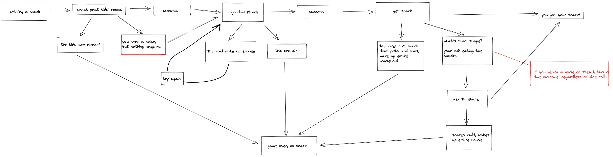
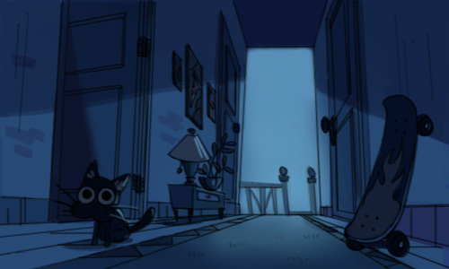
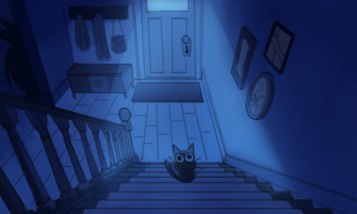
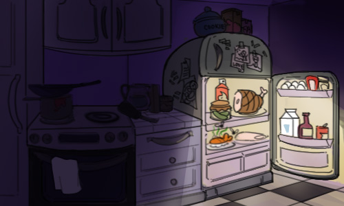
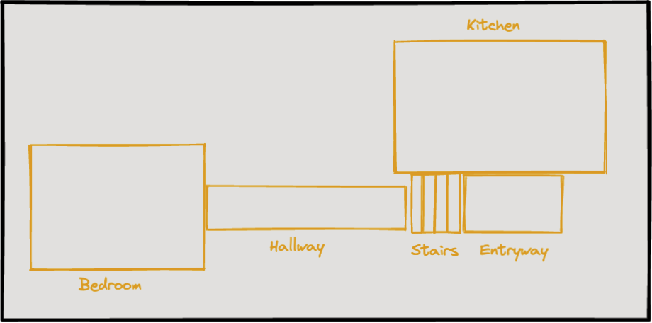

# midnight-snack

## Game Description
The premise of this game is that the player up late and hungry and 
wants a midnight night, but they don't have any groceries. They must
make it through the hallway, down the stairs, and into the kitchen 
without disturbing their roommates. 

At each stage, the player has a few choices for how to proceed. Once
they pick one, they will roll and depending on the number, they are 
will move on to the next step, lose some health or stealth points, or 
die in a freak accident. 

Possible outcomes include tripping over the roommates' cat Josephine,
falling down the stairs, setting the house on fire, or choking to death
on a spoonfull of cereal.

## Future Improvements:
1. There is a map on the bottom of the screen that shows where the 
player's current location is. At this point, the reset function does 
not restore the player marker back to its original position, and that
function needs to be fixed.
2. The game is not optimized for mobile.
3. Would like to add a dice roll animation.

First draft of possible actions:


## Javascript
| Function  | Description |
| --------- | ----------- |
| `displayPlayerInfo()` | Very literal - displays the player information. I had created a player class rather than using an object so that down the line I might be able to expand the game to include more than one player, or to involve a sprite animation moving across a canvas with the choices popping up as you move into set areas on the map. |
| `rollDie()` | Rolls a random number as low as 1 and as high as 20. |
| `rollOk()` | Dictates if the roll button will work. Had run into a problem where you could continuously press the roll button and more and more options would appear. Added in a boolean called pathChosen which requires the player to have clicked one of the game options before rolling the dice. It also stops the player from being able to roll the dice before clicking start (stage !== 0). It removes the roll button after it is pressed. |
| `outcome()` | This is the longest function and it determines the outcome of the player's choice. It runs the rollDie() function and uses the returned value to run through a score(user) function that contains a giant if... else statement. This statement takes into account the stage of the game the user is on: stage 0 is before you press start, stage 1 is in the hallway, stage 2 is on the stairs, stage 3 in the kitchen, and stage 4 if the option you choose in the kitchen requires another step. It also takes into account the choice you made at each stage as each hallChoice, stairsChoice, and kitchenChoice is assigned a number. Lastly, it factors in the number rolled to determine if the action was successful or disastrous. For each option the game text is also updated on the screen. For some options, HP or stealth points are lost. Other functions are called within this one: stageTwo(), stageThree(), stageThreeSmoked(), stageFour(), snacked(). Lastly the displayPlayerInfo() function is run to update any player information that has changed due to the dice roll. |
| `stageTwo()` | Sets the stage to 2. Adds stage two's buttons (stairsAroundBtn, stairsOverBtn). Changes the background image from the hallway picture to the stairs picture. Moves the player's location on the map below the game from the hallway to the stairs. |
| `stageThree()` | Sets the stage to 3. Adds stage three's buttons (smokeBtn, burritoBtn, cerealBtn, sushiBtn). Changes the background image to the kitchen. Moves the player's location on the map below the game from the stairs to the kitchen. |
| `stageThreeSmoked()` | If the player chooses the "smoke first" option in the kitchen, this function runs to bring the player back to the regular kitchen options minus smoking. |
| `stageFour()` | Sets the stage to 4. Adds the continue button. |
| `start()` | Sets the stage to 0. Adds in the buttons for the first options and to reset the game (sneakButton, shooButton, resetButton). Removes the start button. Move's the player's location on the map below the game from the bedroom to the hallway. |
| `shoo()` | Sets the stage to 1. Sets the hallChoice to 1. Sets pathChosen to true. Removes sneakButton and shooButton. Adds roll button. |
| `sneak()` | Does the same as the shoo() function but sets the hallChoice to 0 instead of 1. |
| `downAround()` | Sets stairsChoice to 0. Sets pathChosen to true. Removes the stairsAround and stairsOver buttons. Adds the roll button. |
| `downOver()` | Does the same as the downAround() function but sets the stairsChoice to 1. |
| `chooseSmoke()` | Sets the kitchenChoice to 0. Sets pathChosen to true. Removes the kitchen options (smokeBtn, burritoBtn, cerealBtn, sushiBtn). Adds roll button. |
| `chooseBurrito()` | Does the same as the chooseSmoke() function but sets kitchenChoice to 1. |
| `chooseCereal()` | Does the same as the chooseSmoke() function but sets the kitchenChoice to 2. |
| `chooseSushi()` | Does the same as the chooseSmoke() function but sets the kitchenChoice to 3. |
| `continueOption()` | Checks to see if the players stealth number is less than or equal to 25. If so, the player loses because they are interrupted by their roommates and they don't get a snack. If not, player1.hasEaten is set to true and the snacked() function runs. Continue button is removed. |
| `snacked()` | If player1.hasEaten is true, the game text and player status are updated to reflect that the player has eaten. |
| `resetGame()` | Sets the gameText back to the starting text. Adds the startButton back. Removes all of the following if on the screen: resetButton, sneakButton, shooButton, stairsAroundBtn, stairsOverBtn, smokeBtn, burritoBtn, cerealBtn, sushiBtn, continueBtn, rollButton. Sets pathChosen to false. Sets the background to the hallway picture rather than the stairs or the kitchen pictures. Removes whatever number was last rolled from the game display. Resets the player's information. Displays the player's information on the screen. There is one issue with this function currently, it does not set the player's position on the map back to the starting point. More on this in the Future Improvements section. |

```javascript

// GLOBAL DOM / VARIABLES

const die = document.getElementById('roll');
const rollButton = document.getElementById('die-button');
const rollDisplay = document.getElementById('number');

const startButton = document.getElementById('start-button');
const resetButton = document.getElementById('reset-button');

const journeyButtons = document.getElementById('game-buttons');
const sneakButton = document.getElementById('sneak');
const shooButton = document.getElementById('shoo');
const stairsAroundBtn = document.getElementById('downstairs-around');
const stairsOverBtn = document.getElementById('downstairs-over');
const smokeBtn = document.getElementById('smoke');
const burritoBtn = document.getElementById('burrito');
const cerealBtn = document.getElementById('cereal');
const sushiBtn = document.getElementById('sushi');
const continueBtn = document.getElementById('continue');

const playerInfo = document.getElementById('player-info');
const playerPosition = document.getElementById('player-position');

const hallway = document.getElementById('hallway');
const stairs = document.getElementById('stairs');
const kitchen = document.getElementById('kitchen');

const gameText = document.getElementById('journey-message');

const life = document.getElementById('life');
const hp = document.getElementById('hp');
const stealth = document.getElementById('stealth');
const eat = document.getElementById('eaten');

let rollResult;
let hallChoice;
let stairsChoice;
let kitchenChoice;
let stage;
let pathChosen = false;

// ====================== PAINT INTIAL SCREEN ======================= //

// EVENT LISTENERS
rollButton.addEventListener('click', rollOk);
startButton.addEventListener('click', start);
resetButton.addEventListener('click', resetGame);

sneakButton.addEventListener('click', sneak);
shooButton.addEventListener('click', shoo);

stairsAroundBtn.addEventListener('click', downAround);
stairsOverBtn.addEventListener('click', downOver);

smokeBtn.addEventListener('click', chooseSmoke);
burritoBtn.addEventListener('click', chooseBurrito);
cerealBtn.addEventListener('click', chooseCereal);
sushiBtn.addEventListener('click', chooseSushi);

continueBtn.addEventListener('click', continueOption);

// ====================== ENTITIES ======================= //
class Player {
    constructor() {
        this.maxHP = 100;
        this.currentHP = 100;
        this.maxStealth = 100;
        this.stealth = 100;
        this.hasEaten = false;
        this.alive = true;
    };
};

let player1 = new Player();

// Function to show player stats on page
function displayPlayerInfo() {
    life.innerText = `Alive: ${player1.alive}`;
    hp.innerText = `HP: ${player1.currentHP}`;
    stealth.innerText = `Stealth: ${player1.stealth}`;
};

displayPlayerInfo();

// ====================== GAME PROCESSES ======================= //

// roll 20 sided die
function rollDie() {
    rollResult = 1 + Math.floor(Math.random() * 20);
    rollDisplay.textContent = `You rolled ${rollResult}`;
    return rollResult;
};

// function so that you can only roll if you've chosen an option and have not yet rolled
function rollOk() {
    if (stage !== 0 && pathChosen === true) {
        outcome();
        pathChosen = false;
    };
    rollButton.style.display = 'none';
};

function outcome() {
    let roll = rollDie();
    function score(user) {
        // hall options
        if (stage === 1 && hallChoice === 0 && roll <= 5) {
            user.currentHP = 0;
            user.alive = false;
            gameText.innerText = "Game Over: Your eyes haven't yet adjusted to the dark hallway when your foot catches on something light but unstable. In a freak accident, you try to catch yourself but it's to no avail. Contorted into a pile of limbs you've managed to break your neck. The only snacking you'll be doing is in the afterlife..."
        } else if (stage === 1 && hallChoice === 0 && roll >= 6 && roll <= 15) {
            user.stealth -= 25;
            gameText.innerText = "You trip and make a thumping sound. You think you hear a noise coming from behind one of the bedroom doors but you remain alone in the hallway..."
            stageTwo();
        } else if (stage === 1 && hallChoice === 0 && roll >= 16) {
            gameText.innerText = "You pass by the bedrooms without making a single sound. No sign of your roommates thus far..."
            stageTwo();
        } else if (stage === 1 && hallChoice === 1 && roll <= 5) {
            user.currentHP -= 25;
            user.stealth -= 25;
            gameText.innerText = "Josephine hisses, startling you and you stumble backwards and falling as she runs for the stairs. You think you hear a rustling coming from one of the bedrooms but no one comes out..."
            stageTwo();
        } else if (stage === 1 && hallChoice === 1 && roll >= 6 && roll <= 15) {
            user.stealth -= 25;
            gameText.innerText = "You scare Josephine and she jumps up, runs for the stairs, slides on the rug that you never put a non-slip pad under, and smacks headfirst into the wall..."
            stageTwo();
        } else if (stage === 1 && hallChoice === 1 && roll >= 16) {
            gameText.innerText = "Josephine pads away and you quietly make it over to the top of the stairs..."
            stageTwo();
        } else if (stage === 2 && stairsChoice === 0 && roll <= 5) { // stairs options
            user.currentHP = 0;
            user.alive = false;
            gameText.innerText = "Game Over: You spook Josephine and it pounces on your legs, scratching and biting. You can't maintain your balance! You trip and tumble down the stairs to your death."
        } else if (stage === 2 && stairsChoice === 0 && roll >= 6 && roll <= 15) {
            user.currentHP -= 25;
            user.stealth -= 25;
            gameText.innerText = "You move around Josephine and overshoot the next step, tumbling downward you manage to catch yourself on the banister and head into the kitchen... now let's see what forbidden delights await you..."
            stageThree();
        } else if (stage === 2 && stairsChoice === 0 && roll >= 16) {
            gameText.innerText = "You make it down the stairs and head towards the kitchen... You peer into the fridge taking stock of your roommates' food... maybe you should smoke first..."
            stageThree();
        } else if (stage === 2 && stairsChoice === 1 && roll <= 5) {
            user.currentHP = 0;
            user.alive = false;
            gameText.innerText = "Game Over: You tripped over Josephine and fell down the stairs.";
        } else if (stage === 2 && stairsChoice === 1 && roll >= 6 && roll <= 15) {
            user.currentHP -= 25;
            user.stealth -= 25;
            gameText.innerText = "You spook Josephine and she pounces on your legs, scratching and biting. You can't maintain your balance! You yelp as you trip but you manage not to fall. Peering into the fridge you take stock of your roommates' food... maybe you should smoke first..."
            stageThree();
        } else if (stage === 2 && stairsChoice === 1 && roll >= 16) {
            gameText.innerText = "You make it down the stairs and head towards the kitchen... now let's see what forbidden delights await you..."
            stageThree();
        } else if (stage === 3 && kitchenChoice === 0 && roll <=5) { // kitchen - smoke first
            user.currentHP = 0;
            user.alive = false;
            gameText.innerText = "Game Over: Attempting to smoke out the window, you light up...... the curtains! You panic and slip, knocking your head on the counter and passing out. Congratulations, you've killed everyone... and the cat."
        } else if (stage === 3 && kitchenChoice === 0 && roll >= 6 && roll <= 15) {
            gameText.innerText = "Game Over: Shit... you've been staring at the closed fridge for who knows how long when you realize you're too high for this. You head back to your room in defeat."
            // gameText.innerText = "You fell asleep petting Josephine and giving it treats. You forgot you came to the kitchen for your own snack."
        } else if (stage === 3 && kitchenChoice === 0 && roll >= 16) {
            user.currentHP = 100;
            gameText.innerText = "Just the right amount of toasty, you're ready to eat..."
            stageThreeSmoked();
        } else if (stage === 3 && kitchenChoice === 1 && roll <=5) { // kitchen - microwave burrito
            user.currentHP = 0;
            user.alive = false;
            gameText.innerText = "Game Over: What's that crackling sound you hear? You're not making popcorn. You left the foil on! The entire house explodes! Plans foiled."
        } else if (stage === 3 && kitchenChoice === 1 && roll >= 6 && roll <= 15) {
            user.currentHP -= 15;
            gameText.innerText = "Distracted by your phone, you realize too late you've pressed an extra zero. Aww you burnt the burrito... still good though..."
            stageFour();
        } else if (stage === 3 && kitchenChoice === 1 && roll >= 16) {
            user.hasEaten = true;
            snacked();
        } else if (stage === 3 && kitchenChoice === 2 && roll <=5) { // kitchen - cereal
            user.currentHP = 0;
            user.alive = false;
            gameText.innerText = "Game Over: Josephine startles you and you take a sharp inhale as you're attempting to swallow your first bite of cereal. You can't catch your breath. The room goes dark... Josephine's a cereal killer."
        } else if (stage === 3 && kitchenChoice === 2 && roll >= 6 && roll <= 15) {
            user.stealth -= 50;
            gameText.innerText = "Uh oh! You drop the cereal bowl and it shatters, little pieces clattering all over the floor..."
            stageFour();
        } else if (stage === 3 && kitchenChoice === 2 && roll >= 16) {
            user.hasEaten = true;
            snacked();
        } else if (stage === 3 && kitchenChoice === 3 && roll <=5) { // kitchen - sushi
            user.currentHP = 0;
            user.alive = false;
            gameText.innerText = "Game Over: That sushi wasn't from last night... that sushi was from last MONTH! Death."
        } else if (stage === 3 && kitchenChoice === 3 && roll >= 6 && roll <= 15) {
            gameText.innerText = "You ate your sushi but it smelled just a little off..."
            stageFour();
        } else if (stage === 3 && kitchenChoice === 0 && roll >= 16) {
            user.hasEaten = true;
            snacked();
        };
    };
    score(player1);
    displayPlayerInfo();
};

function stageTwo() {
    stage = 2;
    hallway.style.display = 'none';
    stairs.style.display = 'inline';
    
    stairsAroundBtn.style.display = 'inline';
    stairsOverBtn.style.display = 'inline';

    playerPosition.style.marginLeft = '255px';
};

function stageThree() {
    stage = 3;
    hallway.style.display = 'none';
    stairs.style.display = 'none';
    kitchen.style.display = 'inline';
    
    smokeBtn.style.display = 'inline';
    burritoBtn.style.display = 'inline';
    cerealBtn.style.display = 'inline';
    sushiBtn.style.display = 'inline';

    playerPosition.style.marginTop = '-85px';
    playerPosition.style.marginLeft = '300px';
};

function stageThreeSmoked() {
    burritoBtn.style.display = 'inline';
    cerealBtn.style.display = 'inline';
    sushiBtn.style.display = 'inline';
};

function stageFour() {
    stage = 4;
    continueBtn.style.display = 'inline';
};

// start game
function start() {
    stage = 0;
    sneakButton.style.display = 'inline';
    shooButton.style.display = 'inline';
    startButton.style.display = 'none';
    resetButton.style.display = 'inline';
    playerPosition.style.marginLeft = "150px";
};

// shoo cat
function shoo() {
    stage = 1;
    hallChoice = 1;
    pathChosen = true;
    sneakButton.style.display = 'none';
    shooButton.style.display = 'none';
    rollButton.style.display = 'inline';
};

// sneak past roommates' rooms
function sneak() {
    stage = 1;
    hallChoice = 0;
    pathChosen = true;
    sneakButton.style.display = 'none';
    shooButton.style.display = 'none';
    rollButton.style.display = 'inline';
};

// walk around cat
function downAround() {
    stairsChoice = 0;
    pathChosen = true;
    stairsAroundBtn.style.display = 'none';
    stairsOverBtn.style.display = 'none';
    rollButton.style.display = 'inline';
};

// step over cat
function downOver() {
    stairsChoice = 1;
    pathChosen = true;
    stairsAroundBtn.style.display = 'none';
    stairsOverBtn.style.display = 'none';
    rollButton.style.display = 'inline';
};

// choose to smoke first
function chooseSmoke() {
    kitchenChoice = 0;
    pathChosen = true;
    smokeBtn.style.display = 'none';
    burritoBtn.style.display = 'none';
    cerealBtn.style.display = 'none';
    sushiBtn.style.display = 'none';
    rollButton.style.display = 'inline';
};

// choose microwave burrito
function chooseBurrito() {
    kitchenChoice = 1;
    pathChosen = true;
    smokeBtn.style.display = 'none';
    burritoBtn.style.display = 'none';
    cerealBtn.style.display = 'none';
    sushiBtn.style.display = 'none';
    rollButton.style.display = 'inline';
};

function chooseCereal() {
    kitchenChoice = 2;
    pathChosen = true;
    smokeBtn.style.display = 'none';
    burritoBtn.style.display = 'none';
    cerealBtn.style.display = 'none';
    sushiBtn.style.display = 'none';
    rollButton.style.display = 'inline';
};

function chooseSushi() {
    kitchenChoice = 3;
    pathChosen = true;
    smokeBtn.style.display = 'none';
    burritoBtn.style.display = 'none';
    cerealBtn.style.display = 'none';
    sushiBtn.style.display = 'none';
    rollButton.style.display = 'inline';
};

// kids ate snacks
function continueOption() {
    if (player1.stealth <=25) {
        gameText.innerText = "You've made so much noise you've attracted the attention of your roommates. In an effort to conceal your true purpose, you reach for the one thing you have in the kitchen... a bottle of tequila. You start pouring shots. You pass out before you manage to sneak a snack."
    } else {
        player1.hasEaten = true;
        snacked();
    };
    continueBtn.style.display = 'none';
    // rollButton.style.display = 'inline';
};

// you ate snack
function snacked() {
    if (player1.hasEaten) {
        gameText.innerText = "Belly full, eyes getting sleepy, you head back to your room. Another wonderful midnight snack courtesy of your roommates."
        eat.innerText = 'Status: Hunger Sated'
    };
};

// reset back to start
function resetGame() {
    gameText.innerText = "It's midnight... you're still up... and what's that? You hear a rumbling! But that's not the monster in your closet nor under your bed... it's your monstrous appetite and you need a snack. Too bad you haven't gotten groceries in weeks. Better not disturb your roommates or their cat, Josephine...";
    
    startButton.style.display = 'inline';
    resetButton.style.display = 'none';
    sneakButton.style.display = 'none';
    shooButton.style.display = 'none';
    stairsAroundBtn.style.display = 'none';
    stairsOverBtn.style.display = 'none';
    smokeBtn.style.display = 'none';
    burritoBtn.style.display = 'none';
    cerealBtn.style.display = 'none';
    sushiBtn.style.display = 'none';
    continueBtn.style.display = 'none';
    rollButton.style.display = 'none';
    
    pathChosen = false;

    hallway.style.display = 'inline';
    stairs.style.display = 'none';
    kitchen.style.display = 'none';

    rollDisplay.innerText = '';

    player1.maxHP = 100;
    player1.currentHP = 100;
    player1.maxStealth = 100;
    player1.stealth = 100;
    player1.hasEaten = false;
    player1.alive = true;

    playerPosition.style.marginTop = '160px';
    playerPosition.style.marginLeft = '85px';

    displayPlayerInfo();
};

```

```css

html {
    height: 100%;
}

body {
    background-image: linear-gradient(#DFA200, #5C21AD, #DFA200);
}

#container {
    border: 10px solid black;
    border-radius: 8px;
    max-width: 510px;
    height: auto;
    margin: 0 auto;
    padding: 5px;
    display: grid;
    grid-gap: 0px;
    /* grid-template-rows: 125px 305px 200px; */
    grid-template-rows: 20% 52% 33%;
    grid-template-columns: 1fr 1fr 1fr;
    grid-template-areas: "title title title"
                        "game-area game-area game-area"
                        "start-reset player-info roll"
}

#game-area {
    position: relative;
    height: 300px;
    width: 500px;
    grid-area: game-area;
    top: 50%;
    left: 50%;
    transform: translate(-50%, -50%);
}

#background-image {
    position: absolute;
    z-index: 0;
    max-width: 100%;
    height: auto;
}

#journey-info {
    position: absolute;
    top: 0;
    left: 0;
    position: relative;
    color: white;
    z-index: 10;
}

#game-buttons {
    text-align: center;
}

#title {
    text-align: center;
    grid-area: title;
    font-family: 'Mouse Memoirs', sans-serif;
    font-size: 32px;
}

#player-info {
    grid-area: player-info;
}

#start-reset-buttons {
    text-align: center;
    margin: auto;
    grid-area: start-reset;
}

#roll {
    text-align: center;
    margin: auto;
    grid-area: roll;
}

.game-btn {
    padding: 5px 12px;
    background-color: #DFA200;
    color: white;
    border-radius: 6px;
}

.menu-btn {
    color: white;
    background-color: #5C21AD;
    padding: 8px 22px;
    font-size: 16px;
    border-radius: 8px;
}

#journey-message {
    font-family: 'Barlow', sans-serif;
    margin: 5%;
}

#player-info {
    font-family: 'Barlow', sans-serif;
}

#number {
    font-family: 'Barlow', sans-serif;
    font-weight: bold;
    font-size: large;
}

#please-work {
    max-width: 540px;
    height: 220px;
    position: relative;
    grid-area: map-container
}

#map-area {
    max-width: 510px;
    max-height: 300px;
    margin: 10px auto;
    position: relative;
    display: grid;
    justify-content: center;
    grid-auto-rows: minmax(min-content, max-content);
    grid-template-columns: 100%;
    grid-template-areas: "map-container"
}

#map {
    max-width: 510px;
    position: absolute;
    z-index: 0;
}

#player-position {
    width: 10px;
    height: 10px;
    background: rgb(119, 178, 31);
    position: absolute;
    z-index: 10;
    top: 160px;
    left: 85px;
}

```

`````html

<!DOCTYPE html>
<html lang="en">
<head>
    <meta charset="UTF-8">
    <meta http-equiv="X-UA-Compatible" content="IE=edge">
    <meta name="viewport" content="width=device-width, initial-scale=1.0">
    <meta name="viewport" content="width=device-width, initial-scale=1.0">
    <link rel="preconnect" href="https://fonts.googleapis.com">
    <link rel="preconnect" href="https://fonts.gstatic.com" crossorigin>
    <link href="https://fonts.googleapis.com/css2?family=Barlow&family=Mouse+Memoirs&display=swap" rel="stylesheet">
    <title>Midnight Snack</title>
    <link rel="stylesheet" href="style.css">
</head>
<body>
    <div id="container">
        <div id="title">
            <h1>Midnight Snack</h1>
        </div>
        <div id="game-area">
            <div class="game-visuals" id="background-image">
                
                
                
            </div>
            <div class="game-visuals" id="journey-info">
                <p id="journey-message">It's midnight... you're still up... and what's that? You hear a rumbling! But that's not the monster in your closet nor under your bed... it's your monstrous appetite and you need a snack. Too bad you haven't gotten groceries in weeks. Better not disturb your roommates or their cat, Josephine...</p>
                <div id="game-buttons">
                    <button class="game-btn" id="sneak" style="display: none;">sneak past the bedrooms</button>
                    <button class="game-btn" id="shoo" style="display: none;">shoo the cat</button>
                    <button class="game-btn" id="downstairs-around" style="display: none;">walk around the cat</button>
                    <button class="game-btn" id="downstairs-over" style="display: none;">step over the cat</button>
                    <button class="game-btn" id="smoke" style="display: none;">smoke first</button>
                    <button class="game-btn" id="burrito" style="display: none;">microwave burrito</button>
                    <button class="game-btn" id="cereal" style="display: none;">cereal</button>
                    <button class="game-btn" id="sushi" style="display: none;">leftover sushi</button>
                    <button class="game-btn" id="continue" style="display: none;">continue</button>
                    <button class="game-btn" id="die-button" style="display: none;">Roll</button>

                </div>
            </div>
        </div>
        <div id="player-info">
            <p id="life"></p>
            <p id="hp"></p>
            <p id="stealth"></p>
            <p id="eaten">Status: Still hungry...</p>
        </div>
        <div id="start-reset-buttons">
            <button class="menu-btn" id="start-button" style="display: inline;">Start</button> <br>
            <button class="menu-btn" id="reset-button" style="display: none;">Reset</button>
        </div>
        <div id="roll">
            <p id="number"></p>
        </div>
    </div>
    <div id="map-area">
        <p id="please-work">
            <div id="player-position"></div>
            
        </p>
    </div>
    <script src="app-1.js"></script>
</body>
</html>

```